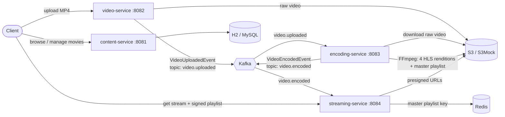

# Netflix Simulator

An event-driven video streaming backend built with Java, Spring Boot and Apache Kafka. A video is uploaded, transcoded with FFmpeg into a multi-quality HLS ladder (1080p, 720p, 480p, 360p), and served to clients through S3 presigned URLs. Movie metadata lives in a separate catalog service.

## Architecture



### Services

| Service | Port | Responsibility |
|---|---|---|
| `content-service` | 8081 | Movie catalog: create, list, search, filter by genre. H2 file database by default, MySQL optional |
| `video-service` | 8082 | Accepts video uploads (up to 2 GB), stores them in S3, publishes a `VideoUploadedEvent` |
| `encoding-service` | 8083 | Consumes `VideoUploadedEvent`, downloads the raw video, encodes it with FFmpeg, uploads the HLS output, publishes a `VideoEncodedEvent` |
| `streaming-service` | 8084 | Consumes `VideoEncodedEvent`, tracks playable videos in Redis, returns streaming URLs and signed HLS playlists |

### How it works

1. **Upload.** `video-service` stores the raw file in S3 and publishes a `VideoUploadedEvent` to the `video.uploaded` topic. The request returns immediately; encoding happens in the background.
2. **Encode.** `encoding-service` downloads the file and runs FFmpeg once per quality (1080p at 5000 kbps, 720p at 2800, 480p at 1200, 360p at 800) with 10-second HLS segments. It writes a master playlist that lists every rendition, uploads everything to S3 under `encoded/{movieId}/`, and cleans up its temp files.
3. **Notify.** A `VideoEncodedEvent` is published to the `video.encoded` topic, keyed by movie ID. On failure, an event with `success=false` and the error message is published instead, so downstream services always get an outcome.
4. **Serve.** `streaming-service` consumes the event and stores the master playlist key in Redis (`streaming:playlist:{movieId}`). The stream endpoint returns `404` until the video is ready, and then returns a streaming response. A second endpoint returns HLS playlists signed for S3 access.

### Design decisions

- **Asynchronous pipeline over Kafka.** Uploads never block on encoding, and each stage can be scaled or restarted independently. Both topics (`video.uploaded`, `video.encoded`) have 3 partitions so different movies can be processed in parallel, and `video.encoded` messages are keyed by movie ID so all events for one movie land on the same partition.
- **Adaptive bitrate streaming (HLS).** Each video is encoded into four renditions with a master playlist, so players can switch quality based on bandwidth.
- **Explicit failure events.** Encoding failures are published as events instead of being swallowed, so consumers can react to them.
- **Redis as the "ready to stream" index.** The stream endpoint reads Redis instead of S3, so readiness checks are cheap.
- **S3 API with a local mock.** The services use the AWS S3 SDK, and `adobe/s3mock` stands in for S3 locally, so no AWS account is needed. Real S3 works by changing environment variables only.
- **Multi-module Maven build.** A parent `pom.xml` ties the four services together, and each service ships with the Maven wrapper.

## Tech Stack

- Java 21, Spring Boot 3, Spring Kafka, Spring Data Redis, Spring Data JPA, Lombok
- Apache Kafka (Confluent 7.4.0) with Zookeeper
- FFmpeg (libx264 video, AAC audio) for HLS transcoding
- AWS S3 SDK, Adobe S3Mock for local development
- Redis
- H2 (default) or MySQL 8.0
- Docker Compose, Maven

## Project Structure

```
Netflix-Simulator/
├── content-service/      # movie catalog (controller, service, repository, model)
├── video-service/        # upload API + Kafka producer
├── encoding-service/     # Kafka consumer + FFmpeg HLS encoding
├── streaming-service/    # Kafka consumer + Redis + signed playlists
├── docker-compose.yml    # Kafka, Zookeeper, Redis, S3Mock, optional MySQL
└── pom.xml               # parent POM
```

## Getting Started

### Prerequisites

- JDK 21
- Docker and Docker Compose
- **FFmpeg** installed and on your `PATH` (or set `FFMPEG_PATH`)
- Maven is optional; every service includes `mvnw` / `mvnw.cmd`

### 1. Start the infrastructure

```bash
docker compose up -d
```

| Component | Host port | Purpose |
|---|---|---|
| Kafka | 9092 | Event streaming |
| Zookeeper | internal | Kafka coordination |
| Redis | 6379 | Playlist index |
| S3Mock | 9090 | Local S3 (bucket `netflix-streaming` is created automatically) |

To use MySQL for the content service instead of H2:

```bash
docker compose --profile mysql up -d
```

Then set `DB_URL`, `DB_USERNAME` and `DB_PASSWORD` before starting `content-service`.

### Kafka topics

Declared in `video-service` (`KafkaConfig`) and created on startup:

| Topic | Partitions | Replicas | Producer | Consumer |
|---|---|---|---|---|
| `video.uploaded` | 3 | 1 | video-service | encoding-service (group `encoding-service-group`) |
| `video.encoded` | 3 | 1 | encoding-service | streaming-service (group `streaming-service-group`) |

### 2. Configuration (optional)

Everything has a local default, so you can skip this for a local run.

| Variable | Used by | Default |
|---|---|---|
| `AWS_ACCESS_KEY` / `AWS_SECRET_KEY` | video, encoding, streaming | `local-access-key` / `local-secret-key` |
| `AWS_REGION` | video, encoding, streaming | `us-east-1` |
| `AWS_S3_ENDPOINT` | video, encoding, streaming | `http://localhost:9090` (S3Mock) |
| `AWS_BUCKET_NAME` | video, encoding, streaming | `netflix-streaming` |
| `AWS_S3_PATH_STYLE_ACCESS` | video, encoding, streaming | `true` |
| `FFMPEG_PATH` | encoding | `ffmpeg` |
| `TEMP_DIR` | encoding | `./data/encoding` |
| `KAFKA_LISTENER_ENABLED` | encoding, streaming | `true` |
| `DB_URL` / `DB_USERNAME` / `DB_PASSWORD` | content | H2 file DB, `sa`, empty |

### 3. Run the services

Open a terminal per service, from the repository root:

```bash
# Windows
cd video-service && mvnw.cmd spring-boot:run

# macOS / Linux
cd video-service && ./mvnw spring-boot:run
```

Repeat for `encoding-service`, `streaming-service` and `content-service`, or run each `*Application` class from your IDE. Each service exposes `/actuator/health`.

## API

### content-service (8081)

| Method | Endpoint | Description |
|---|---|---|
| POST | `/api/v1/movies` | Add a movie to the catalog |
| GET | `/api/v1/movies` | List all movies |
| GET | `/api/v1/movies/{movieId}` | Get a movie by ID |
| GET | `/api/v1/movies/genre/{genre}` | List movies in a genre |
| GET | `/api/v1/movies/search?title=` | Search movies by title |

### video-service (8082)

| Method | Endpoint | Description |
|---|---|---|
| POST | `/api/v1/videos/upload/{movieId}` | Upload a video (multipart, field name `file`). Triggers encoding via Kafka |

### streaming-service (8084)

| Method | Endpoint | Description |
|---|---|---|
| GET | `/api/v1/stream/{movieId}` | Get the streaming response for a video. Returns `404` until encoding has finished |
| GET | `/api/v1/stream/{movieId}/playlist?path=` | Get a signed HLS playlist (`application/x-mpegURL`) |

## Example Flow

```bash
# 1. Upload a video (an MP4 works best)
curl -X POST -F "file=@sample.mp4" http://localhost:8082/api/v1/videos/upload/demo-movie-1

# 2. Watch the encoding-service logs: it downloads the file, encodes
#    1080p / 720p / 480p / 360p, uploads the HLS files and publishes the event

# 3. Once encoding finishes, request the stream
curl http://localhost:8084/api/v1/stream/demo-movie-1
```

Requesting the stream before encoding completes returns `404`. Encoding time depends on the video length and your CPU.

## Testing

```bash
mvn test
```

## Notes

- Credentials in `docker-compose.yml` (for example `MYSQL_ROOT_PASSWORD: root`) are for **local development only**.
- S3Mock keeps its files between runs through the `s3mock-data` Docker volume.
- Encoding is CPU-heavy, because FFmpeg runs once per quality.

## Roadmap

- Dockerfiles for each service so the whole system starts with one command
- API gateway and authentication
- Parallel encoding of renditions
- Retry and dead-letter handling for failed encodes

## Author

**Shiv** ([@ShivathejS](https://github.com/ShivathejS))
